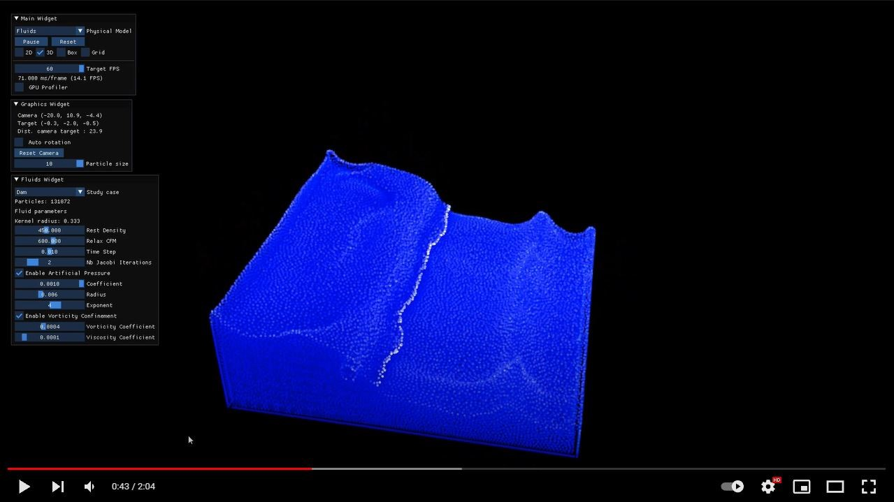

# RealTimeParticles

Minimalist real-time application combining DearImGui/OpenGL and OpenCL to admire and play with small-sized (512) to large (130k) 2D/3D particle systems. 

 ## Demo on YouTube
[](https://youtu.be/8PnJYDknNMA "Video on Youtube")

## Real-Time Physics Models

1.  Boids based on classical [Craig Reynolds](https://www.red3d.com/cwr/boids/) model. Blog post [here](https://axoloto.github.io/rtp/2021-07-11-boids/).
<p align = "center">

</p>

2. Position Based Fluids based on NVIDIA paper [Macklin and Muller, 2013. "Position Based Fluids"](https://mmacklin.com/pbf_sig_preprint.pdf). Blog post [here](https://axoloto.github.io/rtp/2021-10-12-fluids/).
<p align = "center">

</p>

**For best performance, make sure that the application runs on a discrete GPU and not on default IGPU.**

## Requirements

- [Gitbash](https://git-scm.com/downloads)
- [Python](https://www.python.org/) (>= 3.5) + [pip](https://pypi.org/project/pip/)
- [Conan](https://conan.io/) (>=1.56)
- [CMake](https://cmake.org/download/) (>=3.16)
- [NSIS](http://nsis.sourceforge.net/) (only for packaging the installer)
- C++ compiler (Cpp17)
- Device (GPU, IGPU or else) supporting OpenGL and OpenCL 1.2 or higher

### Setup Conan

```
pip install conan
conan remote add conan-center https://conan.io/center/
```

### Ubuntu specific requirements

```bash
sudo apt install git cmake python3-pip libegl-dev libsdl2-dev
conan profile update settings.compiler.libcxx=libstdc++11 default
```

## Build and Run

```bash
git clone https://github.com/axoloto/RealTimeParticles.git
cd RealTimeParticles
./runApp.sh
```

## References

- [CMake](https://cmake.org/)
- [ImGui](https://github.com/ocornut/imgui)
- [Conan](https://conan.io/)
- [OpenCL](https://www.khronos.org/opencl/)
- [SDL2](https://libsdl.org/index.php)
- [Glad](https://glad.dav1d.de/)
- [spdlog](https://github.com/gabime/spdlog)
- [NSIS](http://nsis.sourceforge.net/)
- [OpenCL radix sort](https://github.com/modelflat/OCLRadixSort)
- [Simon Green N-body simulation paper](https://developer.download.nvidia.com/assets/cuda/files/particles.pdf)
- [Perlin Noise C++ implementation](https://github.com/sol-prog/Perlin_Noise)

# Notes

- I reached 60fps with a Nvidia GTX 1650 for the 130k boids 3D model, and 12-30fps for the 3D fluids dam simulation depending on selected settings.
- Tested on Ubuntu, Macos (AMD GPU) and various Windows machines.

# Thanks

A huge thank you to the talented people listed below who helped me on this project:

- [Maitre-Pangolin](https://github.com/Maitre-Pangolin) implemented the first CPU boids model.
- [Frederic Janicki](https://github.com/fjanicki-ssense) initiated conan implementation.
- [vrince](https://github.com/vrince) implemented Linux support.
